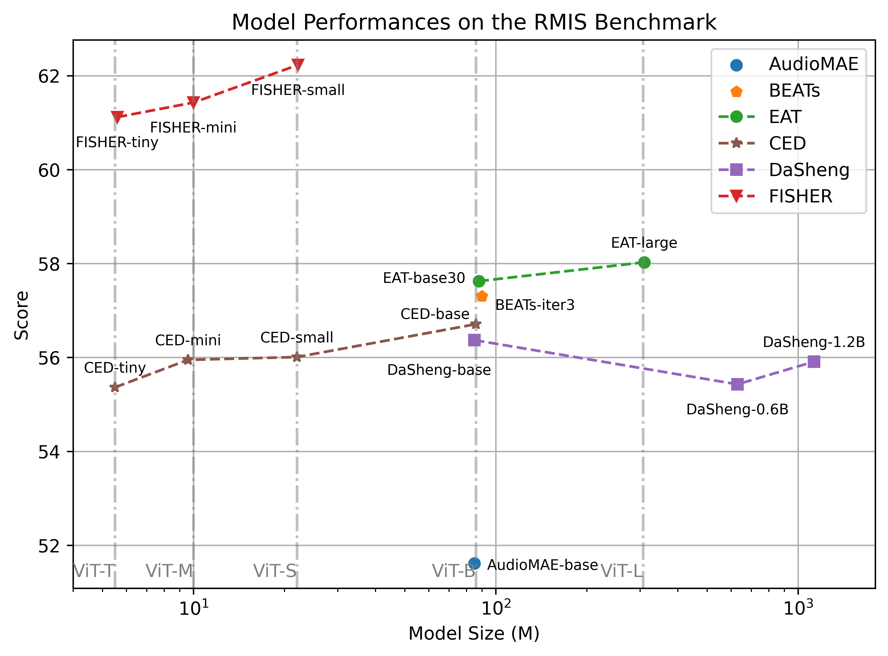

# RMIS Benchmark: Representation of M5 Industrial Signals

[](https://jianganbai.github.io/RMIS)
[](https://arxiv.org/abs/2507.16696)
[](https://www.python.org/)
[](https://pytorch.org/)
[](https://github.com/jianganbai/FISHER)
[](https://opensource.org/licenses/MIT)

## 🚀 News
* **[2026.2.13]** The RMIS benchmark is released.
* **[2025.7.23]** FISHER-tiny, FISHER-mini and FISHER-small are released.


## 📊 Overview

**RMIS** is a comprehensive benchmark for evaluating foundation models on multi-modal series-like industrial signals. It comprises **6 anomaly detection** datasets and **13 fault diagnosis** datasets, covering 4 distinct modalities (sound, vibration, voltage, current) with an unprecedented volume of 1.2k hours. RMIS is sourced from multiple widely-adopted datasets. By open-sourcing RMIS, we hope to provide a fair, convincing and off-the-shelf benchmark for the community to easily evaluate their signal models.

| Anomaly Detection Datasets | Modality | Sampling Rate | Volume | Num Machines |
| :--- | :--- | :--- | :--- | :--- |
| **DCASE 2020** | Sound | 16 kHz | 153 h | 6 |
| **DCASE 2021** | Sound | 16 kHz | 165 h | 7 |
| **DCASE 2022** | Sound | 16 kHz | 139 h | 7 |
| **DCASE 2023** | Sound | 16 kHz | 50 h | 14 |
| **DCASE 2024** | Sound | 16 kHz | 49 h | 16 |
| **DCASE 2025** | Sound | 16 kHz | 45 h | 15 |

| Fault Diagnosis Datasets | Modality | Sampling Rate | Volume | Task |
| :--- | :--- | :--- | :--- | :--- |
| **IICA** | Sound | 48 kHz | 47 h | Leakage |
| **IIEE** | Sound | 44.1 kHz | 1 h | Engine Fault |
| **WTPG** | Vibration | 48 kHz | 14 h | Gearbox Fault |
| **MaFaulDa** | Sound/Vib | 50 kHz | 19 h | Bearing Fault |
| **SDUST** | Vibration | 25.6 kHz | 42 h | Bearing/Gear |
| **UMGED** | Sound/Vib/Vol/Cur | 51.2 kHz | 469 h | Gear Eccentricity |
| **PU** | Vib/Cur | 64 kHz | 9 h | Bearing Fault |

Here anomaly detection is to predict whether a signal is anomalous without any anomalies as prior, while fault diagnosis is to identify the specific fault type of the signal with labeled data provided for reference. For anomaly detection datasets, we evaluate the model in accordance to the [DCASE challenge rules](https://dcase.community/challenge2025/). For fault diagnosis datasets without official splits, we adopt **sealed train-test split** (segments from the same channel of the same recording can not appear in both train and test) to prevent over-optimistic results due to signal stationarity. All models are evaluated by KNN inference without any fine-tuning.

The codebase of RMIS is designed to disentangle model representation with downstream evaluation, whose bottleneck is merely a embedding dict `{file: embed}`. This enables fast adaptation of new models and new datasets. You can easily test your own model on the RMIS benchmark in [just a few steps!](#test-your-model-)

## ⬇️ Download

### Code

First clone the repository and install necessary dependencies.

```shell
git clone https://github.com/jianganbai/RMIS.git
cd RMIS/
pip install -r requirements.txt
```

### Data

The RMIS benchmark is sourced from 13 public datasets: the DCASE datasets ([20](https://dcase.community/challenge2020/task-unsupervised-detection-of-anomalous-sounds), [21](https://dcase.community/challenge2021/task-unsupervised-detection-of-anomalous-sounds), [22](https://dcase.community/challenge2022/task-unsupervised-anomalous-sound-detection-for-machine-condition-monitoring), [23](https://dcase.community/challenge2023/task-first-shot-unsupervised-anomalous-sound-detection-for-machine-condition-monitoring), [24](https://dcase.community/challenge2024/task-first-shot-unsupervised-anomalous-sound-detection-for-machine-condition-monitoring), [25](https://dcase.community/challenge2025/task-first-shot-unsupervised-anomalous-sound-detection-for-machine-condition-monitoring)), [IICA](https://www.idmt.fraunhofer.de/en/publications/datasets/isa-compressed-air.html), [IIEE](https://www.idmt.fraunhofer.de/en/publications/datasets/isa-electric-engine.html), [WTPG](https://github.com/Liudd-BJUT/WT-planetary-gearbox-dataset), [MaFaulDa](https://www02.smt.ufrj.br/~offshore/mfs/page_01.html#SEC2), [SDUST](https://github.com/JRWang-SDUST/SDUST-Dataset), [UMGED](https://github.com/LeeJMJM/UM-GearEccDataset) and [PU](https://groups.uni-paderborn.de/kat/BearingDataCenter/). For the convenience of users, we host all preprocessed benchmark data on [Tsinghua Cloud](https://cloud.tsinghua.edu.cn/d/eb1f8c37f3264812a53c/) (password: RMIS_dataset), which is available for use immediately. If there is any infringement, please contact us for removal. To download data from Tsinghua Cloud, first download all zip files and organize them in the following structure:

```
top_dir/
├── check_sums.md5
├── iiee/
│   └── iiee.zip
├── mafaulda_sound/
│   └── mafaulda_sound.zip
└── dcase24/
    └── dev_data/
        └── dev_ToyCar.zip
```

Then run the following script to conduct md5 checksum and unzip these files. When using the extract script, UMGED split archives require 7z to be available in Bash. You can also extract the UMGED split archives with Bandizip or WinRAR.

```shell
bash utils/scripts/extract_tsinghua_cloud_data.sh path_to_top_dir
```

We also provide setup guidelines for downloading from each dataset source. Please first follow the instructions in `utils/download/README.md` for data download and then refer to `utils/preprocess/README.md` for preprocessing instructions.

### Model

The RMIS benchmark currently integrates 6 models for evaluation: [AudioMAE](rmis/model_conf/audiomae/README.md), [BEATs](rmis/model_conf/beats/README.md), [EAT](rmis/model_conf/eat/README.md), [CED](rmis/model_conf/ced/README.md), [DaSheng](rmis/model_conf/dasheng/README.md) and [FISHER](rmis/model_conf/fisher/README.md). More models will be online soon. All models can be run independently. To setup the evaluation config for a model, please refer to the respective README file within the model config folder `rmis/model_conf/your-interested-model`.


## ⚙️ Usage

### Path Setup and Meta-Data Generation

After downloading the code, the data (convert to 10s wavs) and model checkpoints, you need to fill up the paths to these datasets and checkpoints in `conf/basic.yaml`.

Then you need to generate the meta-data for all datasets:

```shell
python -m runner.meta_data.rmis --ds all
```

### Test Integrated Models

Now you can test integrated models by easily running **one command**!

To calculate the RMIS score over all datasets, run:

```python
python -m rmis.scripts.reg_all \
    --model_conf rmis/model_conf/{model}/{variant}.yaml \
    --rel_exp_dir {rel_exp_dir} \
    --gpu {gpu_str}
```
where `gpu_str` is a string of available GPUs, for example `0,1,2,3`. Each dataset will be evaluated by a GPU exclusively.

To run the extended experiment on multi-split-ratio, run:

```python
python -m rmis.scripts.multi_split_all \
    --model_conf rmis/model_conf/{model}/{variant}.yaml \
    --rel_exp_dir {rel_exp_dir} \
    --gpu {gpu_str}
```

*Note: RMIS is designed to run on Linux. There might be some problems if you are using Windows.*

### Test Your Model !!!

The RMIS codebase is designed to readily integrate new models. You can test your model on the RMIS benchmark in just **two steps!**

#### 1) Implement your model in `models/your-model`

Create a folder for your model `models/your-model`, add the source code of your model inside, and define a model wrapper in `models/your-model/main.py` to wrap your model for RMIS.

```python
class MyAwesomeModel(nn.Module):
    def __init__(self, **kwargs):
        self.model = mymodel(**kwargs)

    def forward(self, x: torch.Tensor): 
        # x is the input signal, can be wav, stft, fbank, etc. specify in model_conf
        x = self.model(x)
        return {'embedding': x}
```

Then, register your model in `models/model_wrapper.py`.

```python
    elif args['model_name'] == 'your-model':
        from models.your-model.main import MyAwesomeModel
        net = MyAwesomeModel(**model_conf)
```

You can refer to how integrated models are implemented.


#### 2) Define inference configurations for you model in `rmis/model_conf/your-model`

Create a folder in `rmis/model_conf` and add inference configurations in `rmis/model_conf/your-model.yaml`. A template config is provided in `model_conf/template.yaml`. It contains five parts:

- Data: `sample_rate`, `feat_type` (wav, stft, fbank), `stft_conf` or `fbank_conf`.
- Preprocess: whether or not to normalize the spectrogram before model.
- Model: `model_name`, `model_conf` (config for setting up your model).
- Inference: `batch_size`
- Dataset specific: specific settings for each dataset, such as adaptive sampling rates.

You can refer to the configurations of integrated models. In the codebase, the input to the model can be raw waveform, STFT (torchaudio, librosa) and FBANK (kaldi, torchaudio, nnaudio, huggingface). You can refer to `datasets/spec.py` for details on implementation. It is strongly recommended to check whether these APIs suit your implementation, since spectrograms of the same type may differ significantly when implemented by difference APIs. If none of them meet your need, you can implement your own input feature in either `datasets/spec.py` or inside your model.

Once you have completed all above steps, you can test your model with a single command!

```python
python -m rmis.scripts.reg_all \
    --model_conf rmis/model_conf/{your-awesome-model}/{variant}.yaml \
    --rel_exp_dir {rel_exp_dir} \
    --gpu {gpu_str}
```

## 🏆 Leaderboard

<div align="center">
  
</div>

Please visit the [RMIS Leaderboard](https://jianganbai.github.io/RMIS/leaderboard.html) for full results.


## Acknowledgements

The RMIS benchmark is completely sourced from 13 public datasets. We sincerely thank these contributors for open-sourcing their data.


## 🖋️ Citation

If you find RMIS useful, please cite:

```bibtex
@article{fan2025fisher,
  title={FISHER: A Foundation Model for Multi-Modal Industrial Signal Comprehensive Representation},
  author={Fan, Pingyi and Jiang, Anbai and Zhang, Shuwei and Lv, Zhiqiang and Han, Bing and Zheng, Xinhu and Liang, Wenrui and Li, Junjie and Zhang, Wei-Qiang and Qian, Yanmin and Chen, Xie and Lu, Cheng and Liu, Jia},
  journal={arXiv preprint arXiv:2507.16696},
  year={2025}
}
```

Please also cite the respective papers of each data source.

## 📄 License
This project is licensed under the MIT License. Individual datasets within RMIS may have their own licenses.
